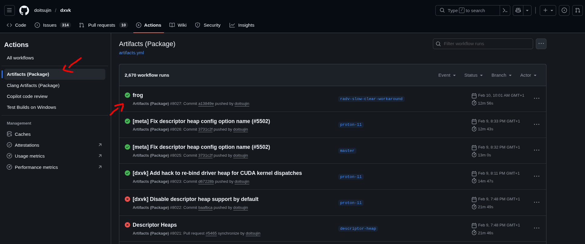
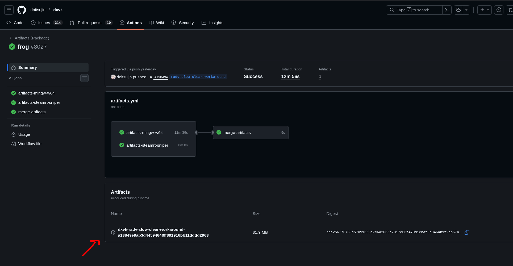
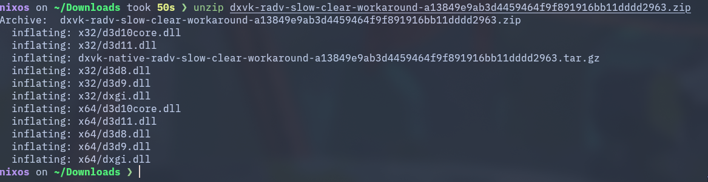

# Installing W3Champions on Linux (Updated Guide)

## Install Wine (Staging)

At least wine 10.16 is required,
which added [initial support for D3DKMT objects](https://gitlab.winehq.org/wine/wine/-/releases/wine-10.16).

Those are used by the Chromium based WebUI of Warcraft III
that was introduced with Reforged.

Before wine 10.16, only Proton supported these shared resources.

Personally, I found the most stable experience using version 10.18.
Some later versions have actually caused some issues.
For now, `wine-10.18 (Staging)` is the recommended version to use, until I was able to do more testing with later versions.

```sh
pacman -S wine-staging
```

## Install DXVK

Since wine added support for shared resources, DXVK has not yet published a release that is compatible with this new change.
However, the support is implemented on the [master branch](https://github.com/doitsujin/dxvk)
thanks to the following [Pull Request](https://github.com/doitsujin/dxvk/pull/5257).

To get a supported DXVK version one can manually download the artifacts from the
[action workflows](https://github.com/doitsujin/dxvk/actions/workflows/artifacts.yml).





Once you got a version with support, extract the ZIP file.



```sh
unzip <dxvk-branch-download-revision>.zip
```

Assuming you are in the same directory as when you extracted the DXVK ZIP file, you should have two directories.

`x64` and `x32`.

Then you can install this DXVK version in the desired wine prefix as follows:

```sh
export WINEPATH="$HOME/Games"
export WINEPREFIX="$WINEPATH/W3Champions"

mkdir -p "$WINEPREFIX"
wineboot --init
winetricks -q dxvk

echo "Installing DXVK DLLs"
for dll in ./x64/*.dll; do
  cp "$dll" "$WINEPREFIX/drive_c/windows/system32/"
done
for dll in ./x32/*.dll; do
  cp "$dll" "$WINEPREFIX/drive_c/windows/syswow64/"
done
```

## WebView2 Runtime (IMPORTANT)

Before, only a very old WebView2 runtime version was supported (109.X).
Using the new versions as described above, one can install the very latest WebView2 runtime versions,
which is required by W3Champions.

### Download

```sh
WEBVIEW_DOWNLOAD_URL="https://go.microsoft.com/fwlink/p/?LinkId=2124701"
WEBVIEW_DOWNLOAD_PATH="$HOME/Downloads/MicrosoftEdgeWebView2RuntimeInstallerX64.exe"
curl -L "$WEBVIEW_DOWNLOAD_URL" --output "$WEBVIEW_DOWNLOAD_PATH"
```

### Install

```sh
wine "$WEBVIEW_DOWNLOAD_PATH"
```

### Set Edge to Windows 7 (IMPORTANT)

You must tell the `msedgewebview2.exe` that the Windows version is 7.

If you forget to do this, W3Champions will later only render a white screen.

You can either do this either using `winecfg` or by running the following in a terminal.

```sh
REG_FILE=$(mktemp /tmp/wine_reg_XXXXXX.reg)

cat > "$REG_FILE" <<'EOF'
Windows Registry Editor Version 5.00

[HKEY_CURRENT_USER\Software\Wine\AppDefaults\msedgewebview2.exe]
"Version"="win7"
EOF

wine regedit /S "$REG_FILE"
```

## Battle.net & Warcraft III

### Download

```sh
BNET_DOWNLOAD_URL="https://downloader.battle.net/download/getInstaller?os=win&installer=Battle.net-Setup.exe"
BNET_DOWNLOAD_PATH="$HOME/Downloads/Battle.net-Setup.exe"
curl -L "$BNET_DOWNLOAD_URL" --output "$BNET_DOWNLOAD_PATH"
```

### Install

```sh
wine "$BNET_DOWNLOAD_PATH"
```

After installing Battle.net, login and download Warcraft III.
Then run Warcraft III once to verify the installed wine and dxvk versions work.

## W3Champions

### Download W3Champions

```sh
W3CHAMPIONS_DOWNLOAD_URL="https://update-service.w3champions.com/api/launcher-e"
W3CHAMPIONS_DOWNLOAD_PATH="$HOME/Downloads/W3Champions_latest_x64_en-US.msi"
curl -L "$W3CHAMPIONS_DOWNLOAD_URL" --output "$W3CHAMPIONS_DOWNLOAD_PATH"
```

### Installing W3Champions

This should work without any errors.
The login should now not crash since we use a new version of the WebView2 runtime.

```sh
wine "$W3CHAMPIONS_DOWNLOAD_PATH"
```
