# Installing W3Champions on Linux

W3Champions, the competitive ladder and matchmaking platform for Warcraft III, is now working on Linux!
This guide will walk you through installing and running it on your system.

---

## Supported Runners

| Runner       | Compatibility    |
| ------------ | ---------------- |
| Proton-GE    | ✅ Supported     |
| wine-staging | ✅ Supported     |
| Other        | ❌ Not Confirmed |

---

## Prerequisites

Before installing W3Champions, ensure you have the following:

- A valid **Warcraft III: Reforged** installation (through Battle.net).
- **Proton-GE (Latest, at least 9-26)** installed, or wine-staging (latest).
- **Lutris** for managing the installation.
- A **Vulkan-capable GPU**.
- The **latest Mesa drivers** installed.
- Follow **Lutris' instructions** for setting up drivers and Wine dependencies on Arch Linux.

---

## Installation

> [!NOTE]  
> This guide will focus on _Arch Linux_, since it has yielded the most success so far.  
> Other distributions work as well, just check for your distributions package manager how to install the required packages.

First, enable multilib (32-bit support).

To enable the multilib repository, uncomment the `[multilib]` section in `/etc/pacman.conf`:

```
/etc/pacman.conf
--------------------------------------------------------------------------------------
[multilib]
Include = /etc/pacman.d/mirrorlist
```

Then upgrade the system:

```
sudo pacman -Syu
```

### AMD GPU Setup

To install support for the Vulkan API and 32-bit games, execute the following command:

```
sudo pacman -S --needed lib32-mesa vulkan-radeon lib32-vulkan-radeon \
    vulkan-icd-loader lib32-vulkan-icd-loader
```

### Installing wine

This may not be necessary, but we recommend to install wine according to the lutris documentation anyway.

```
sudo pacman -S wine-staging
```

Execute the following to install required dependencies:

```
sudo pacman -S --needed --asdeps giflib lib32-giflib gnutls lib32-gnutls \
    v4l-utils lib32-v4l-utils libpulse lib32-libpulse alsa-plugins lib32-alsa-plugins \
    alsa-lib lib32-alsa-lib sqlite lib32-sqlite libxcomposite lib32-libxcomposite \
    ocl-icd lib32-ocl-icd libva lib32-libva gtk3 lib32-gtk3 gst-plugins-base-libs \
    lib32-gst-plugins-base-libs vulkan-icd-loader lib32-vulkan-icd-loader \
    sdl2-compat lib32-sdl2-compat
```

> **Note:** This may seem like a lot of libraries, but they are essential for ensuring game compatibility.

---

## Other Distributions

If you use a different distribution and can make it work, please reach out!

---

## Installing Proton-GE (Latest) with ProtonPlus

To manage Proton and more, we recommend [ProtonPlus](https://github.com/Vysp3r/ProtonPlus)

    yay -S protonplus

Then run ProtonPlus and install the Latest available Proton-GE. You do not need anything else.

## Setting up Lutris

First install lutris.

    pacman -S lutris

Then start lutris and let it download its runtime and dependencies.
By default, lutris will download and use wine-ge-8-26.
This version however does _NOT_ work for W3Champions!
You will not be able to install the required WebView2 runtime using that wine version.

> [!CAUTION]
> After lutris downloaded `wine-ge-8-26`, it will set that wine version as the default runner for all wine builds.
> Make sure that, after that downloaded, you change the runner from `wine-ge-8-26` back to `Proton-GE (Latest)`!
> Forgetting to do so may require starting the whole installation process from scratch in a fresh wine prefix.

In lutris, select the Wine runner on the left side.

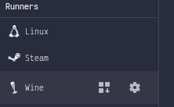

Then change the runner to Proton-GE (Latest)

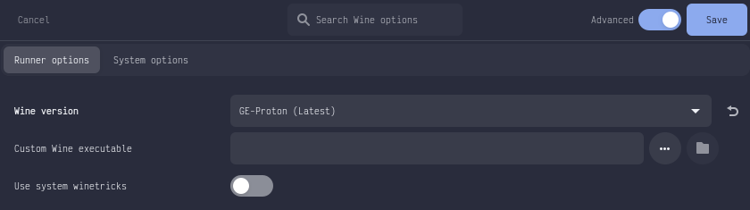

You do not have to change any other runner options and can leave the default values.

You do however have to edit the system options.
Select the system options, toggle the `Advanced` switch, scroll down and add an environment variable.

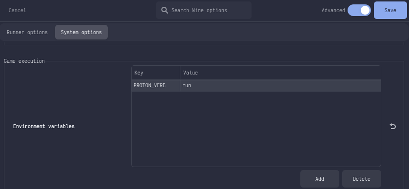

## Lutris installation

The following steps are automated using the `W3Champions.yaml` [script](./W3Champions.yaml).
The script may work, however it tends to get stuck waiting for lingering processes to finish.
For that reason, I will demonstrate the manual method.

### Creating a Lutris Game

First, we create a simple lutris game, without any configuration yet.

Press the plus button in the upper left corner, then select `Add locally installed game`.

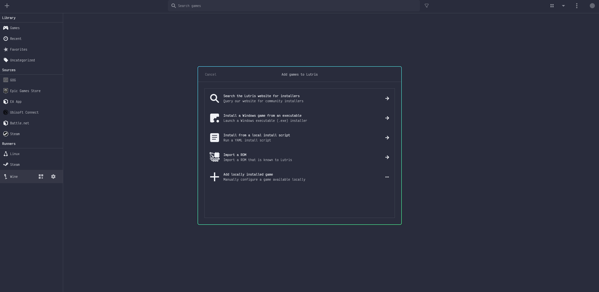

Set any name for the game, we will use `W3Champions`. Select the wine runner for the game.

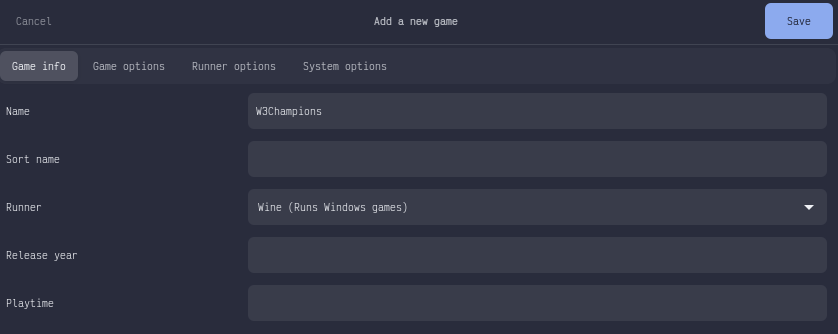

Then in the game options, select the wineprefix. We will use `~/Games/W3Champions`.

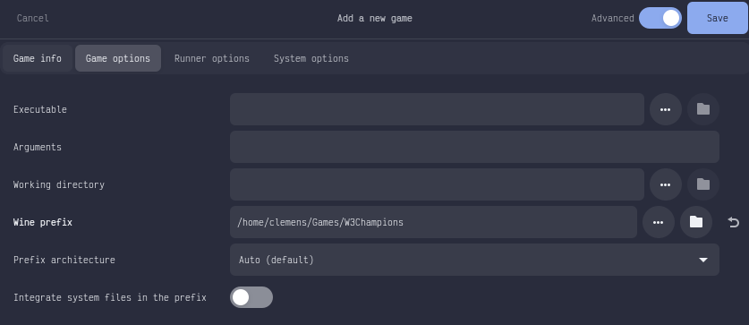

And click Save.

It should create the game as follows.

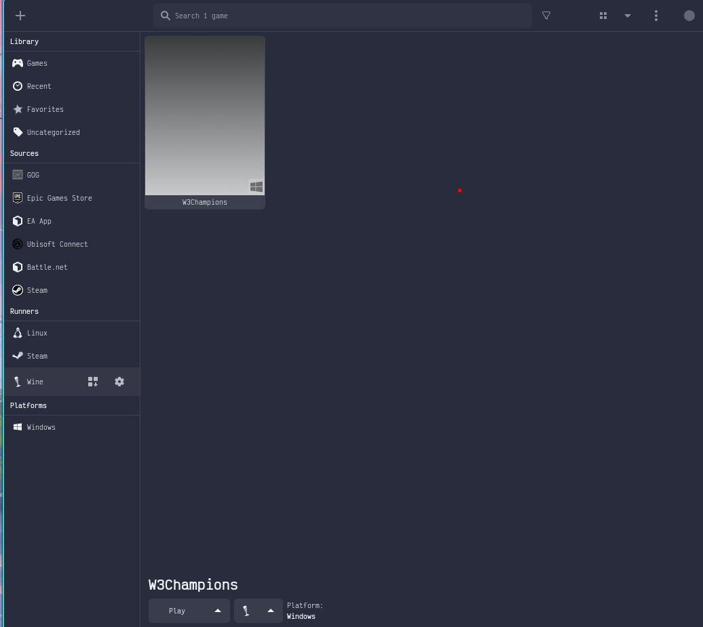

### Installing WebView2

First, we install the WebView2 runtime.

The installer can be downloaded from [here](https://developer.microsoft.com/en-us/microsoft-edge/webview2/?ch=1&form=MA13LH#download).

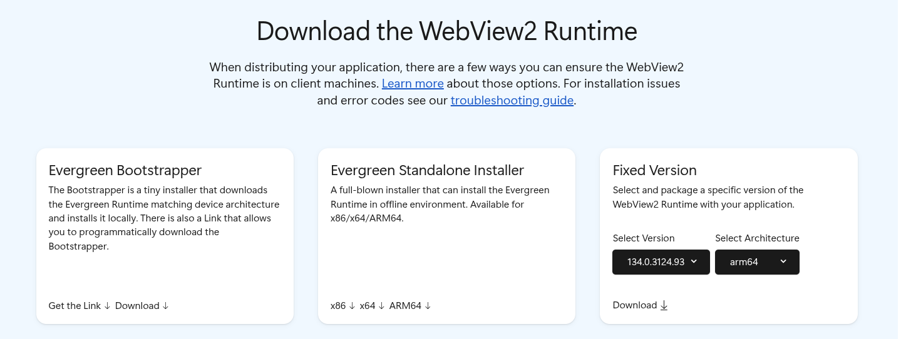

Select the `Evergreen Standalone Installer` for the `x64` architecture.

You can also download the installer using `curl`.

    curl -L "https://go.microsoft.com/fwlink/?linkid=2124701" --output "$HOME/Downloads/MicrosoftEdgeWebView2RuntimeInstallerX64.exe"

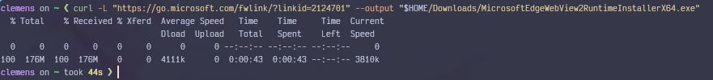

Before actually running the installer, make sure that no previous wine or proton process is still lingering.
That would likely cause issues where the runner wouldnt start at all.
Especially with proton you have to use the PROTON_VERB=run environment variable to have multiple proton processes running at the same time.
You can kill the running processes by executing the following commands.

```sh
for proc in lutris main Warcraft wine Microsoft edge srt-bwrap exe Cr mDNS; do
  pkill "$proc" || true
done
```

Before running any executables in that prefix, also before each of the following steps,
you should always make sure that the potentially lingering processes are killed.

Then, left-clicking on the game in lutris once, we can select to run an EXE inside that prefix.

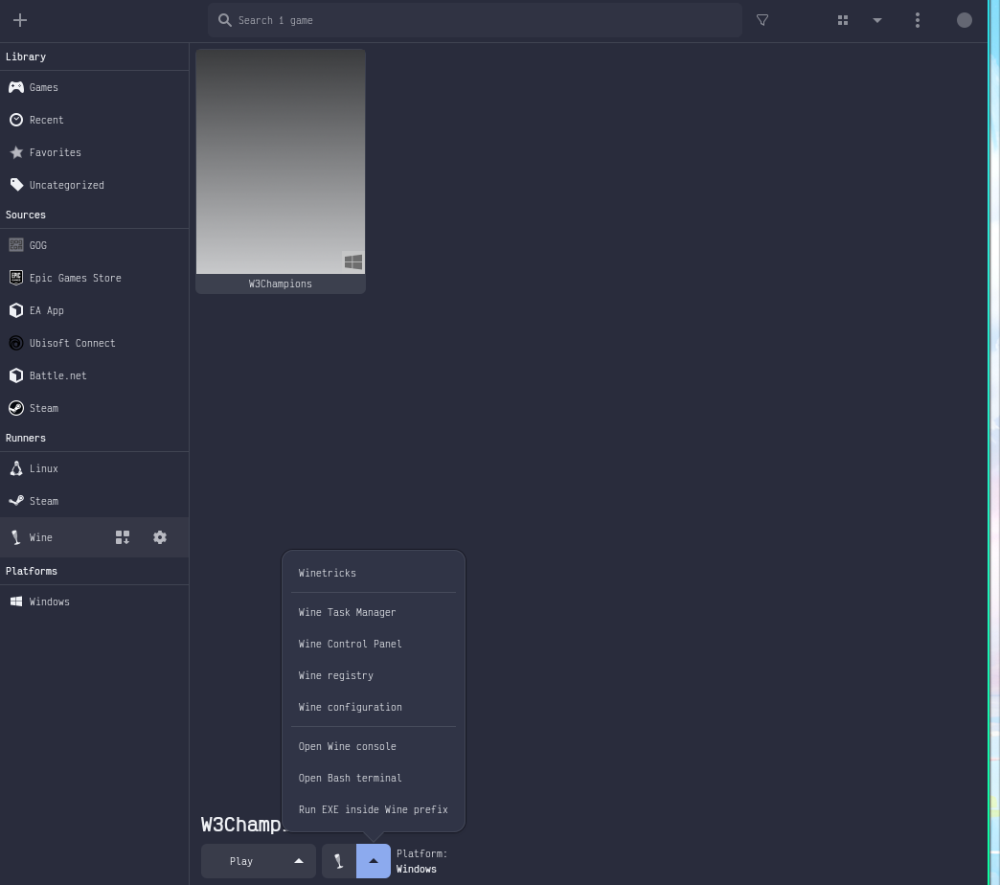

Select the recently downloaded WebView2 runtime installer.

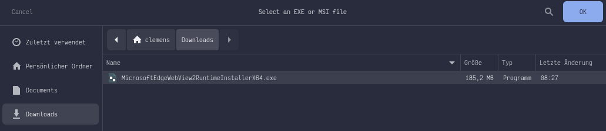

It may take a minute until the WebView2 installer opens up.
It will download the runtime and then install.
No interaction is required for this step.
If the installer closes without any popup or feedback, then it installed successfully. Congrats!
If not, and an error like 0x8003007 appears, then something in the previous steps was not done correctly and you would have to start over.

### Enabling msedgewebview2.exe compatibility

> [!IMPORTANT]  
> You have to set the `msedgewebview2.exe` to Windows 7.
> If you do not do this, all windows running with WebView2 will be just black and unusable.

Select the game, and click on the `Wine configuration` option. It will open `winecfg`.
In there, look for `msedgewebview2.exe`. It will be set to Windows 8.1 by default. This will render all windows black.


Set the version to Windows 7.

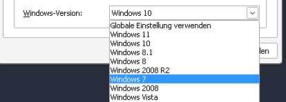

Click Apply and OK.

### Installing Battle.net

Next, installing Battle.net which can be downloaded [here](https://download.battle.net/en-us/?product=bnetdesk).

Alternatively, using `curl`

    curl -L "https://downloader.battle.net/download/getInstaller?os=win&installer=Battle.net-Setup.exe" --output "$HOME/Downloads/Battle.net-Setup.exe"

Run this exe inside the prefix.
This will be a standard Battle.net install.
After installation, login with your Battle.net ID and download Warcraft III: Reforged.
Once Warcraft III was downloaded, start it up.
The lion gate should open and the Blizzard Browser should render properly.
If this is not the case, you may have not the correct Vulkan drivers or GPU drivers installed, or your GPU is incompatible.
Adjust your preferred settings and make sure the reforged mode is deactivated.
Close the game and exit Battle.net after confirming Warcraft III works.

### Installing W3Champions

We can install W3Champions now from [here](https://w3champions.com/getting-started).

Alternatively, using `curl`

    curl -L "https://update-service.w3champions.com/api/launcher-e" --output "$HOME/Downloads/W3Champions_latest_x64_en-US.msi"

Run this exe inside the prefix.
Do not yet launch W3Champions after the installation finishes.

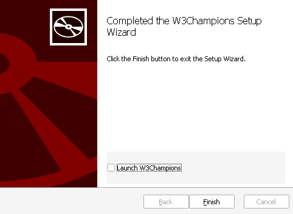

Then, you can configure the lutris game once again.
Select the executable to be `$HOME/Games/W3Champions/drive_c/Program Files/W3Champions/W3Champions.exe` and Save.

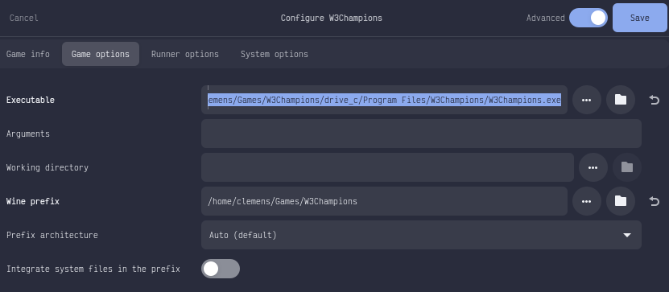

### Running and signing in to W3Champions

You can now double click the W3Champions game in lutris and sign in next.
This step breaks most of the times. We still don't quite understand what exactly makes it break or succeed.
Pressing Sign In will likely cause the launcher to crash.
However, it can work. Starting the launcher, then starting Battle.net, then resetting the Battle.net state can help.
Pressing Sign In may render the Blizzard Auth UI. Sometimes just trying a few times also works.
Rebooting and then running W3Champions first also sometimes helps.
If it simply won't work even after a few tries, there is still a method to Sign In, however it is a real PITA.

#### Bypassing the W3Champions Sign In

To bypass the Sign In, we have to make W3Champions think that we already signed in. We can do that by, well, signing in. Just not linux, but on... Windows 🤐.
Fortunately, a virtual machine will be sufficient. Get into a running Windows system, download and launch W3Champions and sign in.
That will write the information needed for W3Champions to verify you signed in into the AppData.
You can then copy the `C:\users\<user>\AppData\Local\com.w3champions.client` directory to a USB drive.
Then get back into linux, remove the `$HOME/Games/W3Champions/drive_c/users/steamuser/AppData/Local/com.w3champions.client` directory.
And then paste the copied directory from the USB stick to `$HOME/Games/W3Champions/drive_c/users/steamuser/AppData/Local/com.w3champions.client`.

    rm -rf "$HOME/Games/W3Champions/drive_c/users/steamuser/AppData/Local/com.w3champions.client"
    cp -r /mnt/com.w3champions.client "$HOME/Games/W3Champions/drive_c/users/steamuser/AppData/Local/com.w3champions.client"

> [!NOTE]  
> The path `/mnt/com.w3champions.client` assumes that you mounted the USB drive at `/mnt` and that it contains the directory there.
> Adjust this to however you have to.

### Postinstallation steps

You can now launch W3Champions, and it should actually work.
When it boots up the first time, W3Champions will launch the Warcraft III game in offline mode and configure it for use by W3Champions.

> [!IMPORTANT]  
> Do not interact with the launched Warcraft III window.

W3Champions will proceed to install Bonjour for the first time and join a test game on LAN in Warcraft III.
This should work without any actions. On subsequent launcher startups though, we have to restart the `Bonjour Service` for some reason.
To automate this, you can write a batch file somewhere with this content and save it.

```batch
C:
cd C:\Program Files\W3Champions\
start W3Champions.exe
timeout 5
net stop "Bonjour Service"
net start "Bonjour Service"
```

Then select that file as the game executable in lutris.

This will make W3Champions pass the LAN test and you are ready to climb the ladder on linux.

#### Reinstalling

If you already have an existing Warcraft III installation, you can streamline the installation to the prefix.
The [warcraft-copy.sh](./scripts/warcraft-copy.sh) reads the `WARCRAFT_PATH` environment variable
with the path of that existing installation anad copies it into the expected location in the prefix.
From the root of this repository, it can be used like this.

```bash
WARCRAFT_PATH="<your/path/to/Warcraft III>" ./scripts/warcraft-copy.sh
```

If you have an existing W3Champions AppData folder that is authorized,
for example from a Windows VM,
you can streamline the installation of that folder using the [w3c-login-bypass.sh](./scripts/w3c-login-bypass.sh) script.
The script reads the `W3C_AUTH_DATA` environment variable and puts that in the expected location in the prefix.
You can use it like this.

```bash
W3C_AUTH_DATA="<your/path/to/com.w3champions.client" ./scripts/w3c-login-bypass.sh
```

If you have some existing settings and hotkeys,
you can use the [warcraft-settings.sh](./scripts/warcraft-settings.sh)
script to install those settings in the prefix.
This repository contains a German grid-hotkey layout `CustomKeys.txt` and a `War3Preferences.txt` file
to configure Warcraft III using my preferred settings.
You can update these files to your preferences and then run the script to install them.

```bash
./scripts/warcraft-settings.sh
```

## Known issues

### W3Champions can not verify Warcraft III with Battle.net

If you never played W3Champions before, you may have to verify your Warcraft III installation.
For this, you should download the legacy launcher from the w3champions GitHub release page [here](https://github.com/w3champions/launcher/releases),
execute that executable inside the prefix. Install it, then run it.
You should be able to then click play on the legacy launcher
and have it start Warcraft through Battle.net and verify your Warcraft.

### Mouse cursor disappears

When the mouse disappears, switching the workspaces while moving the mouse tends to rerender the mouse on top of the W3Champions Launcher window.
Preventing the window manager from decorating the Warcraft and W3Champions windows can help.
As a last resort, you can use a virtual desktop in wine. In the virtual desktop the cursor will be rendered properly at all times.
On Hyprland, setting the windowrules can help.

```hyprlang
windowrule = content game,class:(steam_app_default),title:()
windowrule = content game,class:(steam_app_default),title:(Battle.net)
windowrule = content game,class:(steam_app_default),title:(W3Champions)
windowrule = content game,class:(steam_app_default),title:(Warcraft III)
windowrule = content game,class:(steam_app_0),title:()
windowrule = content game,class:(steam_app_0),title:(Battle.net)
windowrule = content game,class:(steam_app_0),title:(W3Champions)
windowrule = content game,class:(steam_app_0),title:(Warcraft III)
windowrule = content game,class:(explorer.exe),title:()
windowrule = content game,class:(battle.net.exe),title:(Battle.net)
windowrule = content game,class:(w3champions.exe),title:(W3Champions)
windowrule = content game,class:(warcraft iii.exe),title:(Warcraft III)
windowrule = workspace 2,class:(steam_app_default),title:(Battle.net)
windowrule = workspace 3,class:(steam_app_default),title:()
windowrule = workspace 3,class:(steam_app_default),title:(W3Champions)
windowrule = workspace 4,class:(steam_app_default),title:(Warcraft III)
windowrule = workspace 2,class:(steam_app_0),title:(Battle.net)
windowrule = workspace 3,class:(steam_app_0),title:()
windowrule = workspace 3,class:(steam_app_0),title:(W3Champions)
windowrule = workspace 4,class:(steam_app_0),title:(Warcraft III)
windowrule = workspace 2,class:(battle.net.exe),title:(Battle.net)
windowrule = workspace 3,class:(explorer.exe),title:()
windowrule = workspace 3,class:(w3champions.exe),title:(W3Champions)
windowrule = workspace 4,class:(warcraft iii.exe),title:(Warcraft III)
windowrule = tile,class:(steam_app_default),title:(Battle.net)
windowrule = tile,class:(steam_app_default),title:(W3Champions)
windowrule = tile,class:(steam_app_default),title:(Warcraft III)
windowrule = tile,class:(steam_app_0),title:(Battle.net)
windowrule = tile,class:(steam_app_0),title:(W3Champions)
windowrule = tile,class:(steam_app_0),title:(Warcraft III)
windowrule = tile,class:(battle.net.exe),title:(Battle.net)
windowrule = tile,class:(w3champions.exe),title:(W3Champions)
windowrule = tile,class:(warcraft iii.exe),title:(Warcraft III)
windowrule = noinitialfocus,class:(steam_app_default),title:()
windowrule = noinitialfocus,class:(steam_app_default),title:(Warcraft III)
windowrule = noinitialfocus,class:(steam_app_0),title:()
windowrule = noinitialfocus,class:(steam_app_0),title:(Warcraft III)
windowrule = noinitialfocus,class:(explorer.exe),title:()
windowrule = noinitialfocus,class:(warcraft iii.exe),title:(Warcraft III)
windowrule = move 47% 96%,class:(steam_app_default),title:()
windowrule = move 47% 96%,class:(steam_app_0),title:()
windowrule = move 47% 96%,class:(explorer.exe),title:()
windowrule = opacity 0%,class:(steam_app_default),title:()
windowrule = opacity 0%,class:(steam_app_0),title:()
windowrule = opacity 0%,class:(explorer.exe),title:()
```

Alternatively, running this script to restart W3Champions can make the hassle a little bit less hassle.

```bash
#!/usr/bin/env bash

notify-send "Starting W3Champions"

for proc in main Warcraft wine Microsoft srt-bwrap exe Cr mDNS; do
  pkill "$proc" || true
done

LUTRIS_SKIP_INIT=1 lutris lutris:rungame/w3champions & # you can find the game name using `lutris -l`
```

### Blackscreen / W3Champions not launching

Ensure you have the environment variable `PROTON_VERB=run` set.
If you ever switch runners inside the wineprefix, you may have to reinstall WebView2 and reset the msedgewebview2.exe back to Windows 7.
Should the blackscreen persist, make sure to kill all lingering processes with this snippet.

```bash
for proc in lutris main Warcraft wine Microsoft srt-bwrap exe Cr mDNS; do
  pkill "$proc" || true
done
```

## Discord

- [W3Champions Discord](https://discord.gg/uJmQxG2)

Happy ladder climbing! 🎮
