# Installing W3Champions on Linux

## Automated Setup

A [`setup_complete.sh`](./setup_complete.sh) script is available that automates the full setup.
It detects whether you are on an Arch-based or Debian/Ubuntu-based distro and installs Wine (Staging) accordingly,
then proceeds to set up DXVK, WebView2, Battle.net, and W3Champions.

```sh
bash setup_complete.sh
```

You can optionally pass a custom wine prefix path and a GitHub token (needed to download the DXVK artifact without the `gh` CLI):

```sh
bash setup_complete.sh --prefix="$HOME/Games/W3Champions" --token="<your-github-token>"
```

If you prefer to follow the steps manually, continue below.

## Install Wine (Staging)

At least wine 10.16 is required,
which added [initial support for D3DKMT objects](https://gitlab.winehq.org/wine/wine/-/releases/wine-10.16).

Those are used by the Chromium based WebUI of Warcraft III
that was introduced with Reforged.

Before wine 10.16, only Proton supported these shared resources.

Personally, I found the most stable experience using version 10.18.
Some later versions have actually caused some issues.
For now, `wine-10.18 (Staging)` is the recommended version to use, until I was able to do more testing with later versions.

### Arch Linux

```sh
pacman -S wine-staging
```

### Debian / Ubuntu

First, enable 32-bit support and add the WineHQ signing key:

```sh
sudo dpkg --add-architecture i386
sudo mkdir -pm755 /etc/apt/keyrings
sudo wget -O /etc/apt/keyrings/winehq-archive.key https://dl.winehq.org/wine-builds/winehq.key
```

Then add the repository for your distribution. Use the block that matches your OS:

**Debian 12 (Bookworm):**

```sh
sudo wget -NP /etc/apt/sources.list.d/ \
  https://dl.winehq.org/wine-builds/debian/dists/bookworm/winehq-bookworm.sources
```

**Ubuntu 24.04 (Noble):**

```sh
sudo wget -NP /etc/apt/sources.list.d/ \
  https://dl.winehq.org/wine-builds/ubuntu/dists/noble/winehq-noble.sources
```

**Ubuntu 22.04 (Jammy):**

```sh
sudo wget -NP /etc/apt/sources.list.d/ \
  https://dl.winehq.org/wine-builds/ubuntu/dists/jammy/winehq-jammy.sources
```

Then install wine-staging and winetricks:

```sh
sudo apt update
sudo apt install --install-recommends winehq-staging winetricks
```

## Install DXVK

Since wine added support for shared resources, DXVK has not yet published a release that is compatible with this new change.
However, the support is implemented on the [master branch](https://github.com/doitsujin/dxvk)
thanks to the following [Pull Request](https://github.com/doitsujin/dxvk/pull/5257).

To get a supported DXVK version one can manually download the artifacts from the
[action workflows](<https://github.com/doitsujin/dxvk/actions?query=branch%3Amaster+workflow%3A"Artifacts%20(Package)">).

You should manually download the latest artifact that has a green checkmark.

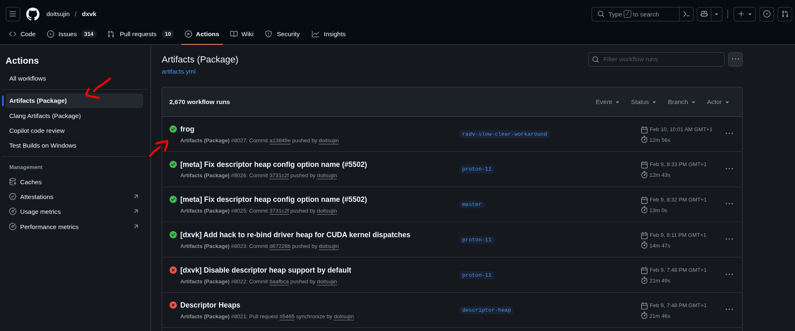

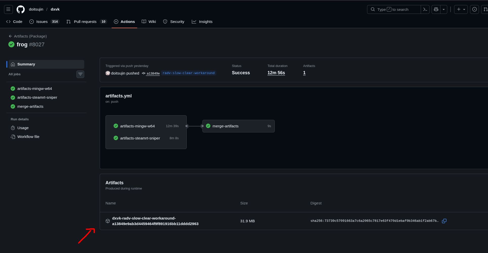

Once you got a version with support, extract the ZIP file.

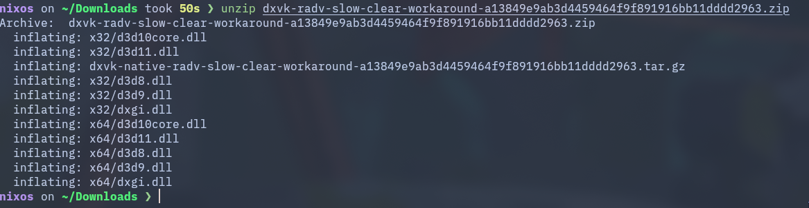

> [!NOTE]
> Debian/Ubuntu users: make sure `unzip` is installed first: `sudo apt install unzip`

```sh
unzip <dxvk-branch-download-revision>.zip
```

Assuming you are in the same directory as when you extracted the DXVK ZIP file, you should have two directories.

`x64` and `x32`.

Then you can install this DXVK version in the desired wine prefix as follows:

```sh
export WINEPATH="$HOME/Games"
export WINEPREFIX="$WINEPATH/W3Champions"

mkdir -p "$WINEPREFIX"
wineboot --init
winetricks -q dxvk

echo "Installing DXVK DLLs"
for dll in ./x64/*.dll; do
  cp "$dll" "$WINEPREFIX/drive_c/windows/system32/"
done
for dll in ./x32/*.dll; do
  cp "$dll" "$WINEPREFIX/drive_c/windows/syswow64/"
done
```

> [!NOTE]
> It may seem unintuitive, but the DLLs really have to go in these respective directories
> according to the upstream [documentation](https://github.com/doitsujin/dxvk?tab=readme-ov-file#how-to-use)

## WebView2 Runtime (IMPORTANT)

Before, only a very old WebView2 runtime version was supported (109.X).
Using the new versions as described above, one can install the very latest WebView2 runtime versions,
which is required by W3Champions.

### Download

```sh
WEBVIEW_DOWNLOAD_URL="https://go.microsoft.com/fwlink/p/?LinkId=2124701"
WEBVIEW_DOWNLOAD_PATH="$HOME/Downloads/MicrosoftEdgeWebView2RuntimeInstallerX64.exe"
curl -L "$WEBVIEW_DOWNLOAD_URL" --output "$WEBVIEW_DOWNLOAD_PATH"
```

### Install

```sh
wine "$WEBVIEW_DOWNLOAD_PATH"
```

### Default Windows version

The default Windows version is typically set to "Windows 10". This is fine.

If it is set to "Windows 11", W3Champions will later only render a white screen.

### Set Edge to Windows 7 (IMPORTANT)

You must tell the `msedgewebview2.exe` that the Windows version is 7.

If you forget to do this, W3Champions will later only render a white screen.

You can either do this using `winecfg` or by running the following in a terminal.

```sh
REG_FILE=$(mktemp /tmp/wine_reg_XXXXXX.reg)

cat > "$REG_FILE" <<'EOF'
Windows Registry Editor Version 5.00

[HKEY_CURRENT_USER\Software\Wine\AppDefaults\msedgewebview2.exe]
"Version"="win7"
EOF

wine regedit /S "$REG_FILE"
```

## Battle.net & Warcraft III

### Download

```sh
BNET_DOWNLOAD_URL="https://downloader.battle.net/download/getInstaller?os=win&installer=Battle.net-Setup.exe"
BNET_DOWNLOAD_PATH="$HOME/Downloads/Battle.net-Setup.exe"
curl -L "$BNET_DOWNLOAD_URL" --output "$BNET_DOWNLOAD_PATH"
```

### Install

```sh
wine "$BNET_DOWNLOAD_PATH"
```

After installing Battle.net, login and download Warcraft III.
Then run Warcraft III once to verify the installed wine and dxvk versions work.

## W3Champions

### Download

```sh
W3CHAMPIONS_DOWNLOAD_URL="https://update-service.w3champions.com/api/launcher-e"
W3CHAMPIONS_DOWNLOAD_PATH="$HOME/Downloads/W3Champions_latest_x64_en-US.msi"
curl -L "$W3CHAMPIONS_DOWNLOAD_URL" --output "$W3CHAMPIONS_DOWNLOAD_PATH"
```

### Install

This should work without any errors.
The login should now not crash since we use a new version of the WebView2 runtime.

```sh
wine "$W3CHAMPIONS_DOWNLOAD_PATH"
```

### Run

```sh
wine "$WINEPREFIX/drive_c/Program Files/W3Champions/W3Champions.exe"
```

## Troubleshooting

If something isn't working, run the diagnostic script and paste the full output into a [GitHub issue](https://github.com/clemenscodes/W3ChampionsOnLinux/issues):

```sh
bash scripts/diagnose.sh
```

It checks Wine version, DXVK version and DLL overrides, Windows version in the prefix, WebView2 runtime, Vulkan drivers (64-bit and 32-bit), GPU driver versions against DXVK minimum requirements, game installations, Bonjour, and firewall ports.

Ideally you should see an output similar to this:

```
=== W3ChampionsOnLinux Diagnostic Report ===
Date : 2026-05-01 05:43 UTC

### System
Distro       : NixOS 26.05 (Yarara)
Kernel       : 6.18.24-cachyos
Session type : wayland
DISPLAY      : :0
WAYLAND      : wayland-1
Compositor   : Hyprland

### GPU & Drivers
  01:00.0 VGA compatible controller: NVIDIA Corporation GB202 [GeForce RTX 5090] (rev a1)
  03:00.0 VGA compatible controller: NVIDIA Corporation GA102 [GeForce RTX 3080] (rev a1)
  7b:00.0 VGA compatible controller: Advanced Micro Devices, Inc. [AMD/ATI] Granite Ridge [Radeon Graphics] (rev c9)
NVIDIA driver : 595.58.03
Vulkan drivers (64-bit):
  asahi  (Vulkan 1.4.335)
  broadcom  (Vulkan 1.3.335)
  dzn  (Vulkan 1.1.335)
  freedreno  (Vulkan 1.4.335)
  gfxstream  (Vulkan 1.1.335)
  intel_hasvk  (Vulkan 1.3.335)
  intel  (Vulkan 1.4.335)
  lvp  (Vulkan 1.4.335)
  nouveau  (Vulkan 1.4.335)
  nvidia  (Vulkan 1.4.329)
  panfrost  (Vulkan 1.4.335)
  powervr_mesa  (Vulkan 1.4.335)
  radeon  (Vulkan 1.4.335)
  virtio  (Vulkan 1.4.335)
Vulkan drivers (32-bit):
  asahi  (Vulkan 1.4.335)
  broadcom  (Vulkan 1.3.335)
  dzn  (Vulkan 1.1.335)
  freedreno  (Vulkan 1.4.335)
  gfxstream  (Vulkan 1.1.335)
  intel_hasvk  (Vulkan 1.3.335)
  intel  (Vulkan 1.4.335)
  lvp  (Vulkan 1.4.335)
  nouveau  (Vulkan 1.4.335)
  nvidia  (Vulkan 1.4.329)
  panfrost  (Vulkan 1.4.335)
  powervr_mesa  (Vulkan 1.4.335)
  radeon  (Vulkan 1.4.335)
  virtio  (Vulkan 1.4.335)
AMD GPU     : radeon (RADV/Mesa) ICD OK for 64-bit and 32-bit
AMD driver  : Mesa 26.0.5
NVIDIA GPU  : nvidia ICD OK for 64-bit and 32-bit

### Required Tools
wine : OK
winecfg : OK
winetricks : OK
unzip : OK
curl : OK

### Wine
Version    : wine-11.7 (Staging)
WINEPREFIX : /home/clemens/Games/W3Champions
WINEARCH   : win64

### DXVK
64-bit d3d11.dll : v2.7.1-452-ga13849e9
32-bit d3d11.dll : v2.7.1-452-ga13849e9
d3d11 override : native

### Wineprefix Configuration
Prefix : /home/clemens/Games/W3Champions
Windows version : win10
msedgewebview2 compat : win7

### WebView2 Runtime
Version : 147.0.3912.72

### Game Installations
Battle.net   : /home/clemens/Games/W3Champions/drive_c/Program Files (x86)/Battle.net/Battle.net.exe
W3Champions  : /home/clemens/Games/W3Champions/drive_c/Program Files/W3Champions/W3Champions.exe
Warcraft III : /home/clemens/Games/W3Champions/drive_c/Program Files (x86)/Warcraft III/_retail_/x86_64/Warcraft III.exe
Bonjour      : /home/clemens/Games/W3Champions/drive_c/Program Files/Blizzard/Bonjour Service/mDNSResponder.exe

### Firewall
Required : TCP 3550 3551 3552  |  UDP 3552 5353  |  mDNS multicast 224.0.0.251 UDP 5353
Firewall tool : nftables
Ports : required ports appear open

### Summary
No issues detected.
```

## Known Issues

### Battle.net won't install

Probably related to missing 32-bit libraries for your vulkan driver. Try installing them and reinstall Battle.net with a fresh prefix.

### W3Champions installs but I get joinbugs almost every time I find a match

This is unfortunately not reliably fixed yet. A fix is being worked on.

### Mouse cursor disappears

When the mouse disappears, switching workspaces while moving the mouse tends to re-render it on top of the W3Champions window.
Preventing the window manager from decorating the Warcraft and W3Champions windows can help.
As a last resort, you can use a virtual desktop in wine. The cursor will be rendered properly at all times inside it.

On Hyprland, setting the following windowrules can help:

```hyprlang
windowrule = content game,class:(explorer.exe),title:()
windowrule = content game,class:(battle.net.exe),title:(Battle.net)
windowrule = content game,class:(w3champions.exe),title:(W3Champions)
windowrule = content game,class:(warcraft iii.exe),title:(Warcraft III)
windowrule = workspace 2,class:(battle.net.exe),title:(Battle.net)
windowrule = workspace 3,class:(explorer.exe),title:()
windowrule = workspace 3,class:(w3champions.exe),title:(W3Champions)
windowrule = workspace 4,class:(warcraft iii.exe),title:(Warcraft III)
windowrule = tile,class:(battle.net.exe),title:(Battle.net)
windowrule = tile,class:(w3champions.exe),title:(W3Champions)
windowrule = tile,class:(warcraft iii.exe),title:(Warcraft III)
windowrule = noinitialfocus,class:(explorer.exe),title:()
windowrule = noinitialfocus,class:(warcraft iii.exe),title:(Warcraft III)
windowrule = move 47% 96%,class:(explorer.exe),title:()
windowrule = opacity 0%,class:(explorer.exe),title:()
```

### W3Champions cannot verify Warcraft III with Battle.net

If you never played W3Champions before, you may need to verify your Warcraft III installation.
Download the legacy launcher from the [w3champions GitHub release page](https://github.com/w3champions/launcher/releases),
run it inside the prefix, then click Play on the legacy launcher to start Warcraft through Battle.net and verify it.

### White screen / W3Champions not launching

Run `bash scripts/diagnose.sh` first. It will flag the most common causes automatically.

Manual checks:

- Make sure the default Windows version in `winecfg` is set to **Windows 10** (not Windows 11).
  Fix: `winecfg /v win10`
- Make sure `msedgewebview2.exe` is set to **Windows 7** (see above).
- If the white screen persists, try killing all lingering wine processes and restarting:

```sh
for proc in main Warcraft wine Microsoft edge exe Cr mDNS; do
  pkill "$proc" || true
done
```

## Discord

- [W3Champions Discord](https://discord.gg/uJmQxG2)

Happy ladder climbing!

<details>
<summary><strong>Legacy Method: Lutris + Proton-GE (deprecated)</strong></summary>

> [!WARNING]
> This method is deprecated. The Wine-based guide above is the recommended approach.
> This section is kept for reference in case the Lutris/Proton-GE method works better for your setup.

### Prerequisites

- A valid **Warcraft III: Reforged** installation (through Battle.net).
- **Proton-GE (Latest, at least 9-26)** installed, or wine-staging (latest).
- **Lutris** for managing the installation.
- A **Vulkan-capable GPU**.
- The **latest Mesa drivers** installed.
- Follow **Lutris' instructions** for setting up drivers and Wine dependencies on Arch Linux.

---

### Arch Linux Setup

> [!NOTE]
> This guide will focus on _Arch Linux_, since it has yielded the most success so far.
> Other distributions work as well, just check your distribution's package manager for the required packages.

First, enable multilib (32-bit support) by uncommenting the `[multilib]` section in `/etc/pacman.conf`:

```
[multilib]
Include = /etc/pacman.d/mirrorlist
```

Then upgrade the system:

```sh
sudo pacman -Syu
```

#### AMD GPU

To install support for the Vulkan API and 32-bit games, execute the following command:

```sh
sudo pacman -S --needed lib32-mesa vulkan-radeon lib32-vulkan-radeon \
    vulkan-icd-loader lib32-vulkan-icd-loader
```

#### Wine dependencies

This may not be necessary, but we recommend installing wine according to the Lutris documentation anyway.

```sh
sudo pacman -S wine-staging
```

Execute the following to install required dependencies:

```sh
sudo pacman -S --needed --asdeps giflib lib32-giflib gnutls lib32-gnutls \
    v4l-utils lib32-v4l-utils libpulse lib32-libpulse alsa-plugins lib32-alsa-plugins \
    alsa-lib lib32-alsa-lib sqlite lib32-sqlite libxcomposite lib32-libxcomposite \
    ocl-icd lib32-ocl-icd libva lib32-libva gtk3 lib32-gtk3 gst-plugins-base-libs \
    lib32-gst-plugins-base-libs vulkan-icd-loader lib32-vulkan-icd-loader \
    sdl2-compat lib32-sdl2-compat
```

> **Note:** This may seem like a lot of libraries, but they are essential for ensuring game compatibility.

---

### Installing Proton-GE with ProtonPlus

To manage Proton and more, we recommend [ProtonPlus](https://github.com/Vysp3r/ProtonPlus):

```sh
yay -S protonplus
```

Run ProtonPlus and install the latest available Proton-GE. You do not need anything else.

### Setting up Lutris

```sh
pacman -S lutris
```

> [!CAUTION]
> Download the latest Lutris release from [here](https://github.com/lutris/lutris/releases) if you run into any issues.
> You might have problems running the latest Proton-GE if you run an outdated version of Lutris.

Start Lutris and let it download its runtime and dependencies.
By default, Lutris will download and use `wine-ge-8-26`.
This version however does _NOT_ work for W3Champions!
You will not be able to install the required WebView2 runtime using that wine version.

> [!CAUTION]
> After Lutris downloads `wine-ge-8-26`, it will set that wine version as the default runner for all wine builds.
> Make sure that, after that downloaded, you change the runner from `wine-ge-8-26` back to **Proton-GE (Latest)**!
> Forgetting to do so may require starting the whole installation process from scratch in a fresh wine prefix.

In Lutris, select the Wine runner on the left side.

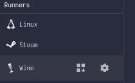

Then change the runner to Proton-GE (Latest).

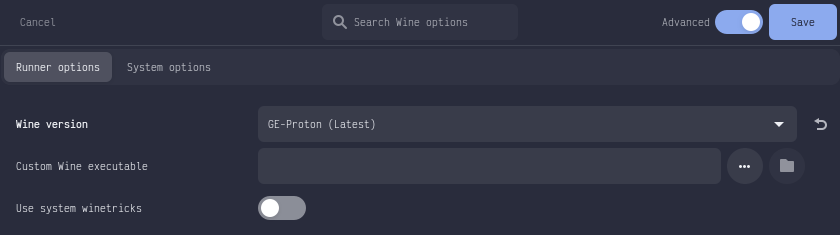

You do not have to change any other runner options and can leave the default values.

You do however have to edit the system options.
Select the system options, toggle the `Advanced` switch, scroll down and add an environment variable.

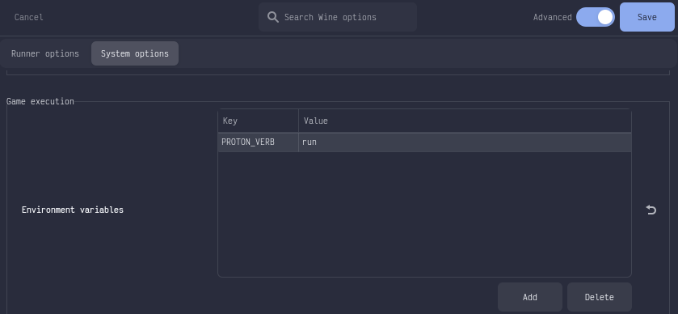

> [!CAUTION]
> It might be required to add the environment variable `WINE_SIMULATE_WRITECOPY=1` to run Battle.net with Proton-GE.
> Try setting this if you encounter any issues with Battle.net.

### Lutris Installation

The following steps are automated using the `W3Champions.yaml` [script](./W3Champions.yaml).
The script may work, however it tends to get stuck waiting for lingering processes to finish.
For that reason, the manual method is demonstrated below.

### Creating a Lutris Game

First, we create a simple Lutris game, without any configuration yet.

Press the plus button in the upper left corner, then select **Add locally installed game**.

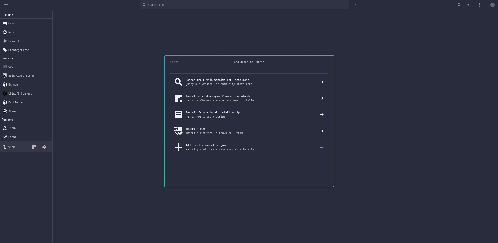

Set any name for the game, we will use `W3Champions`. Select the wine runner for the game.

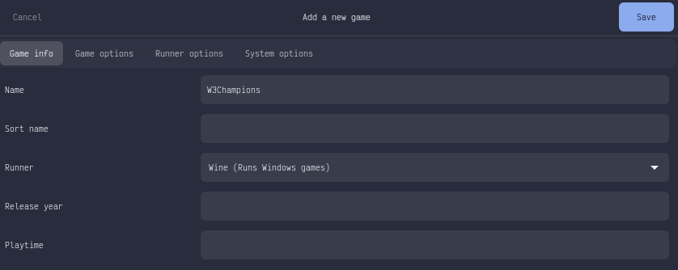

Then in the game options, select the wineprefix. We will use `~/Games/W3Champions`.

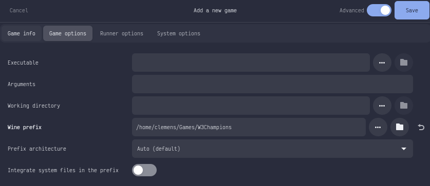

And click Save.

It should create the game as follows.

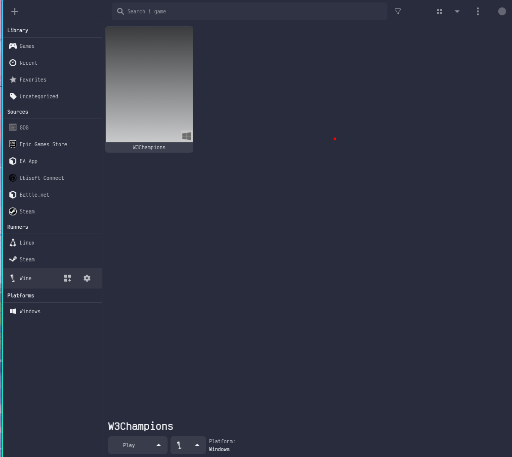

### Installing WebView2

First, we install the WebView2 runtime.

> [!IMPORTANT]
> Very recent versions of WebView2 will still render a blackscreen.
> Currently, only version 109.X is supported and confirmed to be working with W3Champions.
> The runtime installer can be downloaded from this repository's [release page](https://github.com/clemenscodes/W3ChampionsOnLinux/releases).
> Alternatively, download it from [archive.org](https://archive.org/download/microsoft-edge-web-view-2-runtime-installer-v109.0.1518.78/MicrosoftEdgeWebView2RuntimeInstallerX64.exe).

You can also download the installer using `curl`:

```sh
curl -L "https://github.com/clemenscodes/W3ChampionsOnLinux/releases/download/proton-ge-9-27/MicrosoftEdgeWebView2RuntimeInstallerX64.exe" \
  --output "$HOME/Downloads/MicrosoftEdgeWebView2RuntimeInstallerX64.exe"
```

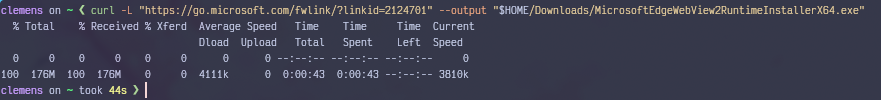

Before actually running the installer, make sure that no previous wine or proton process is still lingering.
That would likely cause issues where the runner wouldn't start at all.
Especially with Proton you have to use the `PROTON_VERB=run` environment variable to have multiple proton processes running at the same time.
You can kill the running processes by executing the following commands:

```sh
for proc in lutris main Warcraft wine Microsoft edge srt-bwrap exe Cr mDNS; do
  pkill "$proc" || true
done
```

Before running any executables in that prefix — and also before each of the following steps — you should always make sure that any lingering processes are killed.

Then, left-clicking on the game in Lutris once, we can select to run an EXE inside that prefix.

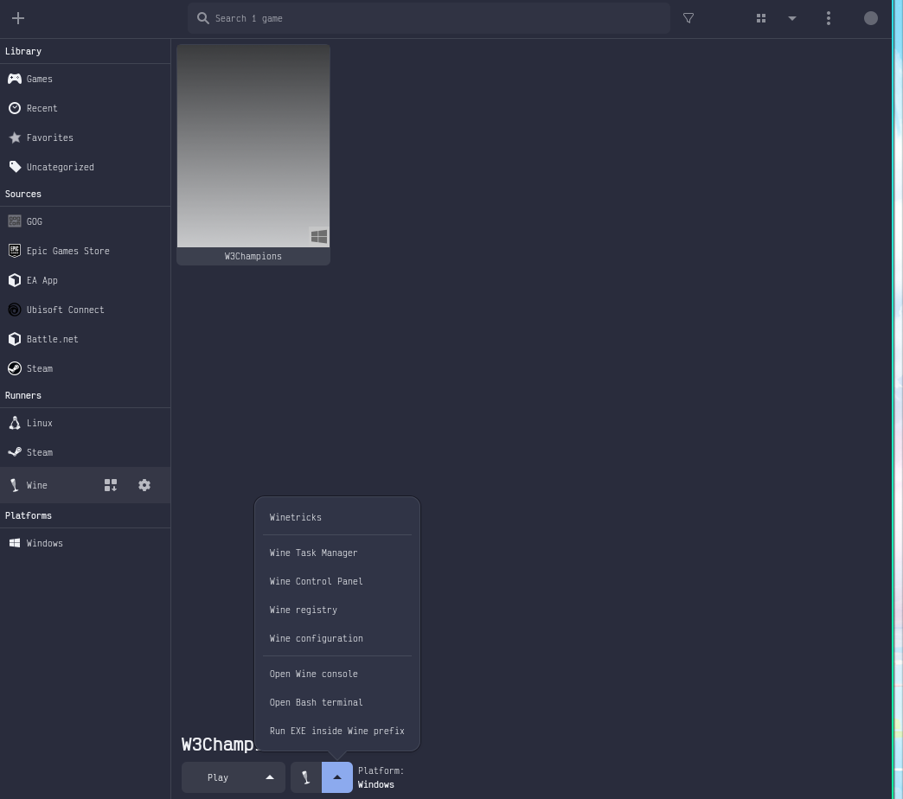

Select the recently downloaded WebView2 runtime installer.

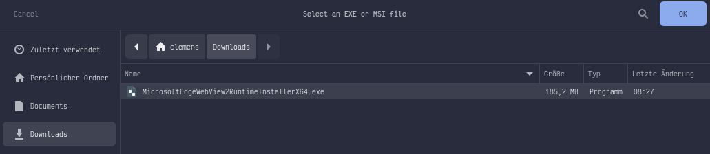

It may take a minute until the WebView2 installer opens up.
It will download the runtime and then install.
No interaction is required for this step.
If the installer closes without any popup or feedback, then it installed successfully. Congrats!
If not, and an error like `0x8003007` appears, then something in the previous steps was not done correctly and you would have to start over.

### Enabling msedgewebview2.exe compatibility

> [!IMPORTANT]
> You have to set the `msedgewebview2.exe` to Windows 7.
> If you do not do this, all windows running with WebView2 will be just black and unusable.

Select the game, and click on the **Wine configuration** option. It will open `winecfg`.
In there, look for `msedgewebview2.exe`. It will be set to Windows 8.1 by default. This will render all windows black.

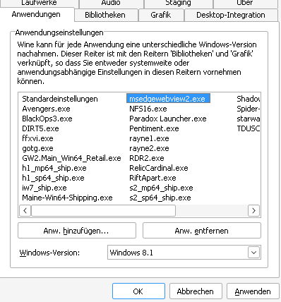

Set the version to Windows 7.

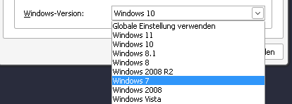

Click Apply and OK.

### Installing Battle.net

Next, install Battle.net, which can be downloaded [here](https://download.battle.net/en-us/?product=bnetdesk).

Alternatively, using `curl`:

```sh
curl -L "https://downloader.battle.net/download/getInstaller?os=win&installer=Battle.net-Setup.exe" \
  --output "$HOME/Downloads/Battle.net-Setup.exe"
```

Run this EXE inside the prefix.
This will be a standard Battle.net install.
After installation, login with your Battle.net ID and download Warcraft III: Reforged.
Once Warcraft III was downloaded, start it up.
The lion gate should open and the Blizzard Browser should render properly.
If this is not the case, you may not have the correct Vulkan drivers or GPU drivers installed, or your GPU is incompatible.
Adjust your preferred settings and make sure the reforged mode is deactivated.
Close the game and exit Battle.net after confirming Warcraft III works.

### Installing W3Champions

We can install W3Champions now from [here](https://w3champions.com/getting-started).

Alternatively, using `curl`:

```sh
curl -L "https://update-service.w3champions.com/api/launcher-e" \
  --output "$HOME/Downloads/W3Champions_latest_x64_en-US.msi"
```

Run this EXE inside the prefix.
Do not yet launch W3Champions after the installation finishes.

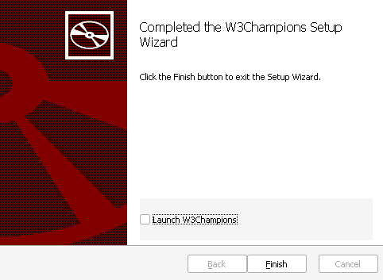

Then, you can configure the Lutris game once again.
Select the executable to be `$HOME/Games/W3Champions/drive_c/Program Files/W3Champions/W3Champions.exe` and Save.

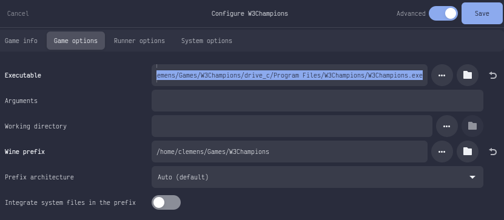

### Running and Signing In to W3Champions

You can now double click the W3Champions game in Lutris and sign in next.
This step breaks most of the times. We still don't quite understand what exactly makes it break or succeed.
Pressing Sign In will likely cause the launcher to crash.
However, it can work. Starting the launcher, then starting Battle.net, then resetting the Battle.net state can help.
Pressing Sign In may render the Blizzard Auth UI. Sometimes just trying a few times also works.
Rebooting and then running W3Champions first also sometimes helps.
If it simply won't work even after a few tries, there is still a method to Sign In, however it is a real PITA.

#### Bypassing the W3Champions Sign In

To bypass the Sign In, we have to make W3Champions think that we already signed in. We can do that by, well, signing in — just not on Linux, but on Windows 🤐.
Fortunately, a virtual machine will be sufficient. Get into a running Windows system, download and launch W3Champions and sign in.
That will write the information needed for W3Champions to verify you signed in into the AppData.
You can then copy the `C:\users\<user>\AppData\Local\com.w3champions.client` directory to a USB drive.
Then get back into Linux, remove the existing directory, and paste the copied one from the USB stick:

```sh
rm -rf "$HOME/Games/W3Champions/drive_c/users/steamuser/AppData/Local/com.w3champions.client"
cp -r /mnt/com.w3champions.client "$HOME/Games/W3Champions/drive_c/users/steamuser/AppData/Local/com.w3champions.client"
```

> [!NOTE]
> The path `/mnt/com.w3champions.client` assumes that you mounted the USB drive at `/mnt` and that it contains the directory there.
> Adjust this to however you have to.

### Post-installation Steps (REQUIRED — Do Not Skip!)

> [!IMPORTANT]
> You can now launch W3Champions, and it should actually work.
> Do not interact with the launched Warcraft III window.
> W3Champions will proceed to install Bonjour for the first time and join a test game on LAN in Warcraft III.
> This should work without any actions. On subsequent launcher startups though, we have to restart the `Bonjour Service` for some reason.
> To automate this, write a batch file somewhere with this content and save it.

```batch
C:
start "" "C:\Program Files\W3Champions\W3Champions.exe"
net stop "Bonjour Service"
net start "Bonjour Service"
```

Then select that file as the game executable in Lutris.

This will make W3Champions pass the LAN test and you are ready to climb the ladder on Linux.

#### Reinstalling

If you already have an existing Warcraft III installation, you can streamline the installation to the prefix.
The [warcraft-copy.sh](./scripts/warcraft-copy.sh) reads the `WARCRAFT_PATH` environment variable
with the path of that existing installation and copies it into the expected location in the prefix.
From the root of this repository, it can be used like this:

```sh
WARCRAFT_PATH="<your/path/to/Warcraft III>" ./scripts/warcraft-copy.sh
```

If you have an existing W3Champions AppData folder that is authorized (for example from a Windows VM),
you can streamline the installation of that folder using the [w3c-login-bypass.sh](./scripts/w3c-login-bypass.sh) script.
The script reads the `W3C_AUTH_DATA` environment variable and puts that in the expected location in the prefix:

```sh
W3C_AUTH_DATA="<your/path/to/com.w3champions.client>" ./scripts/w3c-login-bypass.sh
```

If you have some existing settings and hotkeys,
you can use the [warcraft-settings.sh](./scripts/warcraft-settings.sh) script to install those settings in the prefix.
This repository contains a German grid-hotkey layout [CustomKeys.txt](./assets/config/CustomKeys.txt) and a [War3Preferences.txt](./War3Preferences.txt)
to configure Warcraft III with my preferred settings.
You can update these files to your preferences and then run the script to install them:

```sh
./scripts/warcraft-settings.sh
```

### Lutris Known Issues

#### W3Champions cannot verify Warcraft III with Battle.net

If you never played W3Champions before, you may have to verify your Warcraft III installation.
For this, download the legacy launcher from the [w3champions GitHub release page](https://github.com/w3champions/launcher/releases),
execute that executable inside the prefix, install it, then run it.
You should be able to click Play on the legacy launcher and have it start Warcraft through Battle.net to verify your installation.

#### Mouse cursor disappears

When the mouse disappears, switching workspaces while moving the mouse tends to re-render it on top of the W3Champions window.
Preventing the window manager from decorating the Warcraft and W3Champions windows can help.
As a last resort, you can use a virtual desktop in wine — the cursor will be rendered properly at all times inside it.

Alternatively, running this script to restart W3Champions can make the hassle a little less painful:

```sh
#!/usr/bin/env bash

notify-send "Starting W3Champions"

for proc in main Warcraft wine Microsoft srt-bwrap exe Cr mDNS; do
  pkill "$proc" || true
done

LUTRIS_SKIP_INIT=1 lutris lutris:rungame/w3champions &  # find the game name using `lutris -l`
```

#### Blackscreen / W3Champions not launching

Ensure you have the environment variable `PROTON_VERB=run` set.
If you ever switch runners inside the wineprefix, you may have to reinstall WebView2 and reset `msedgewebview2.exe` back to Windows 7.
Should the blackscreen persist, kill all lingering processes:

```sh
for proc in lutris main Warcraft wine Microsoft srt-bwrap exe Cr mDNS; do
  pkill "$proc" || true
done
```

### Screenshots

Connected W3Champions launcher.

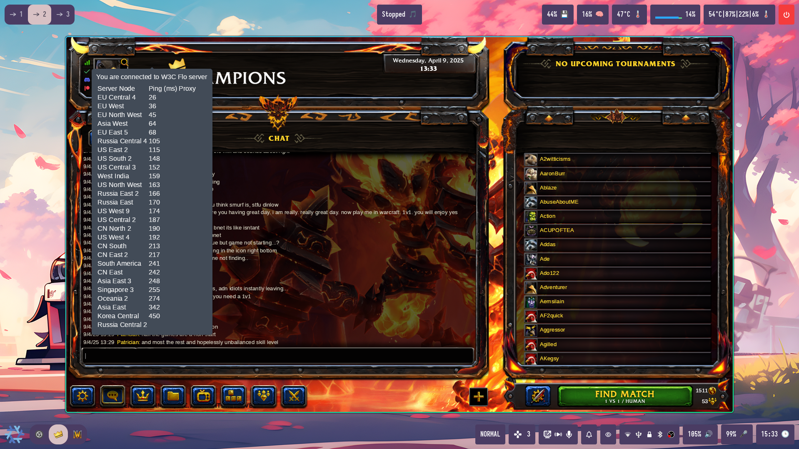

Offline Warcraft III instance.

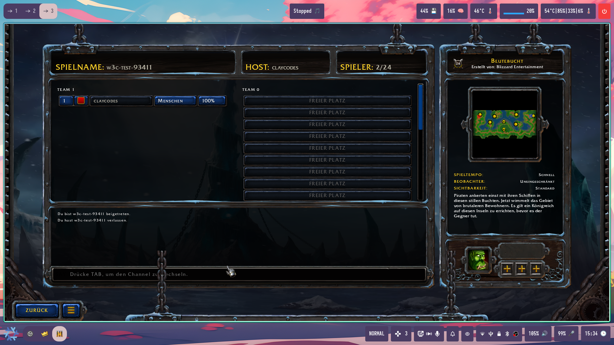

Ingame launcher.

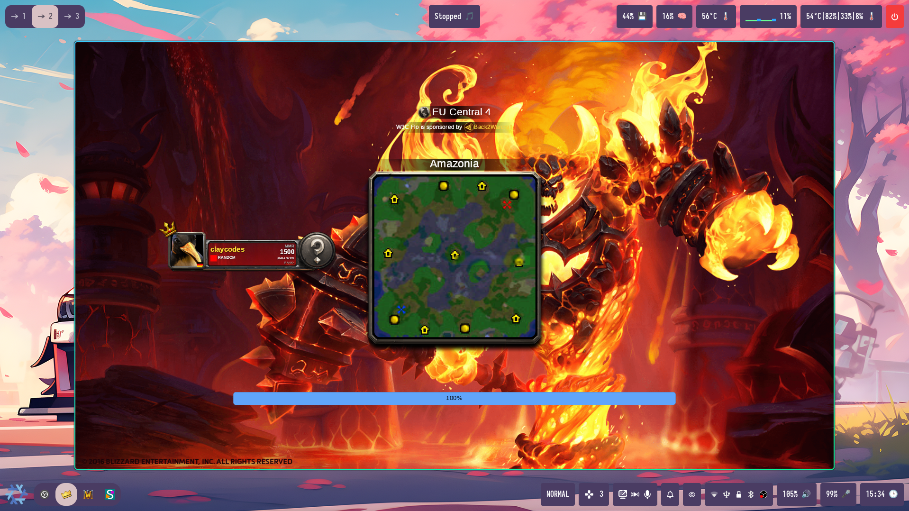

Ingame client.

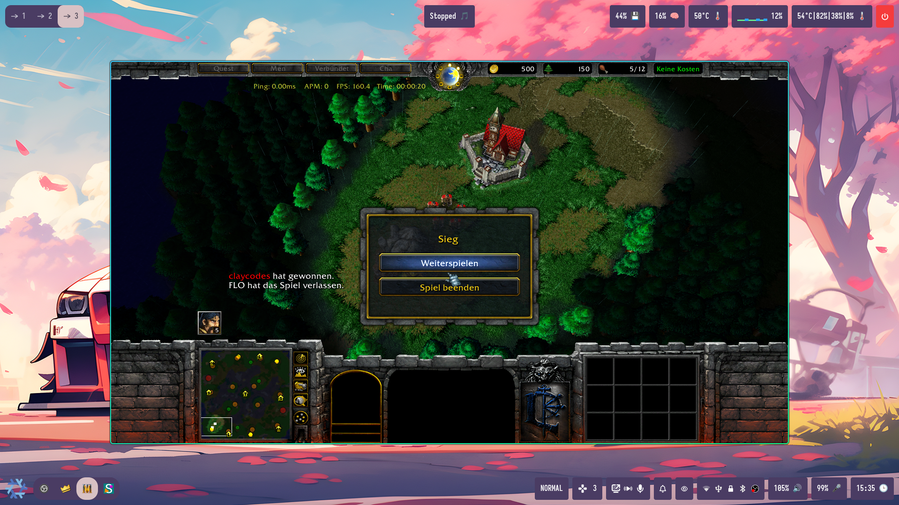

Postgame stats.

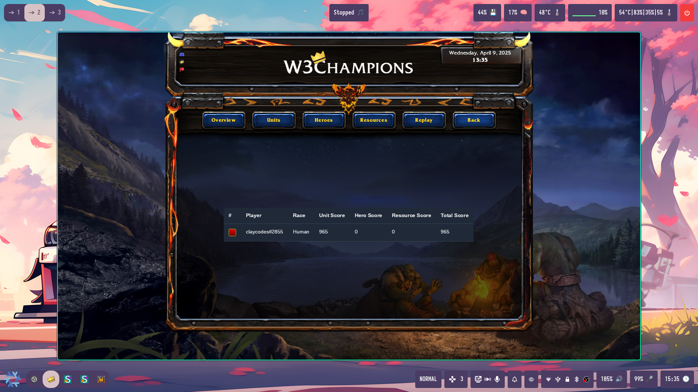

Postgame lobby.

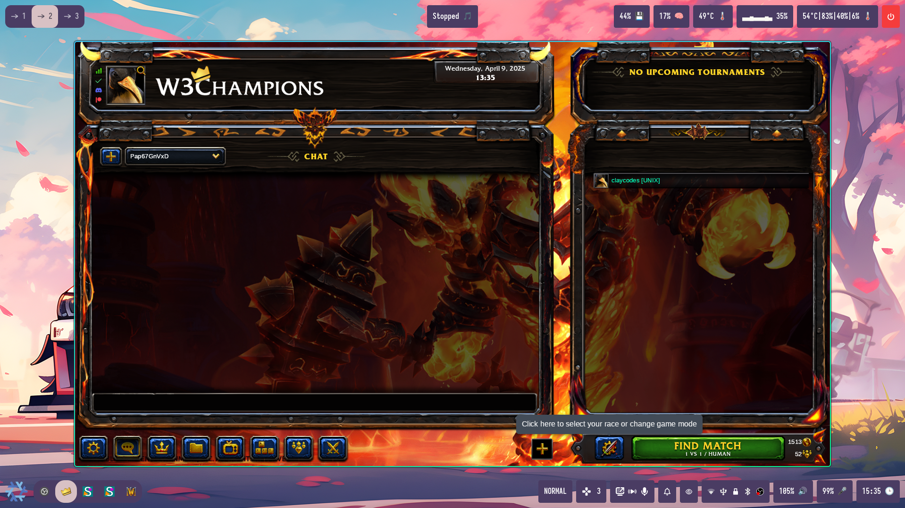

Watching replays works.

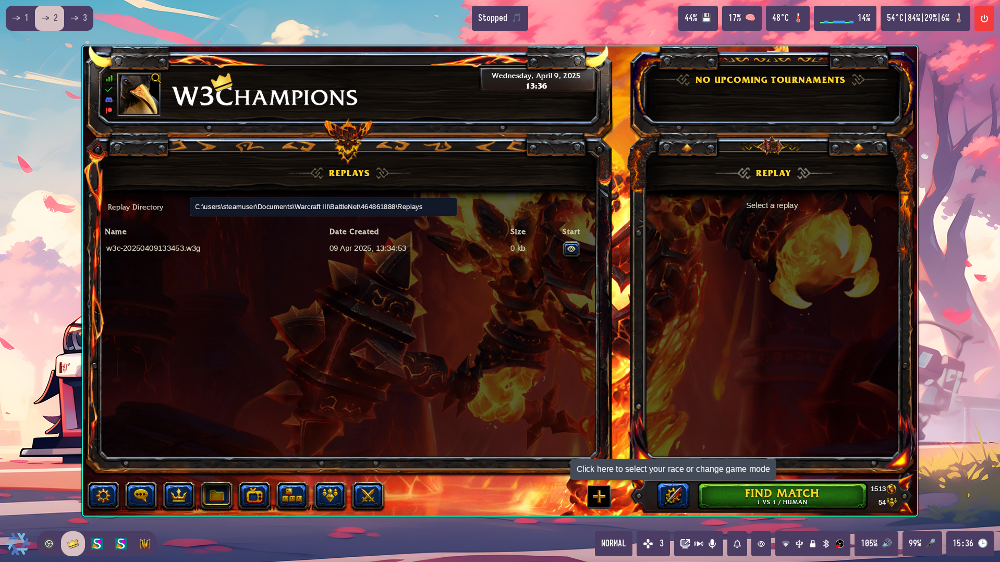

Observing FLO games works.

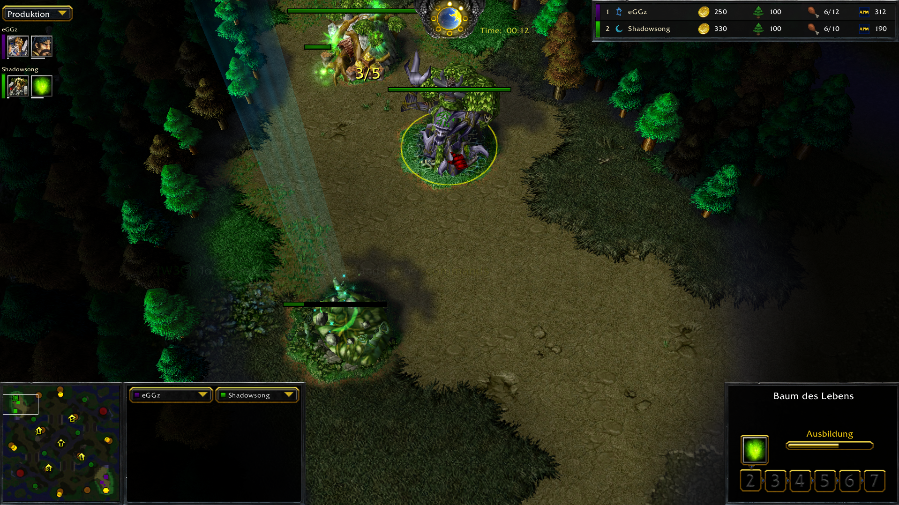

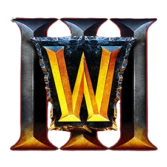

</details>
